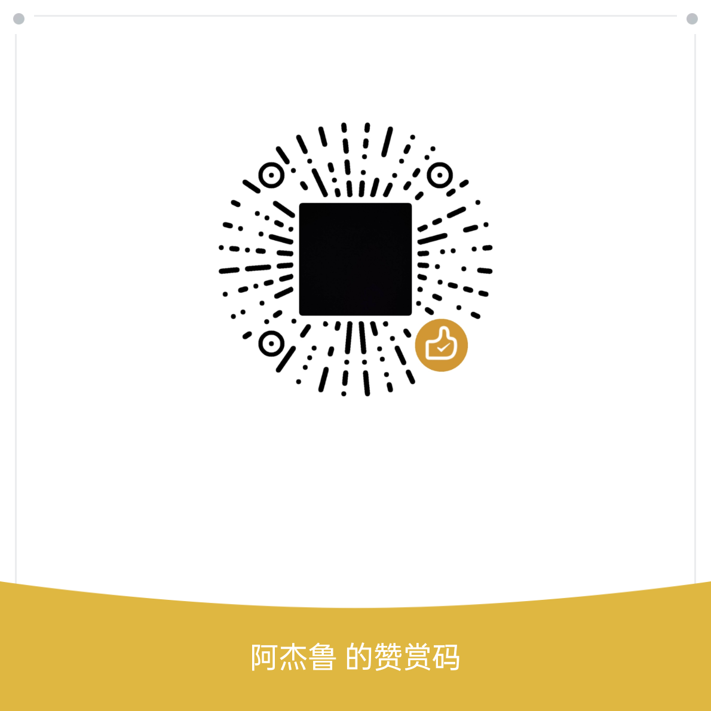

# XUGOU - Lightweight Monitoring Platform Based on CloudFlare

<div align="center">


XUGOU is a lightweight system monitoring platform based on CloudFlare, providing system monitoring and status page functionality.

English | [简体中文](./README.md)

</div>

## 📅 Development Plan

Currently implemented features:

- ✅ System Monitoring - Client resource monitoring and data reporting
- ✅ HTTP Monitoring - API endpoint health detection and analysis
- ✅ Data Visualization - Real-time data display and historical trend analysis
- ✅ Status Page - Customizable service status page

Planned features:

- 🚧 Real-time Notifications - Anomaly event notifications through multiple channels (Email, Webhook, Slack, etc.)

## ✨ Core Features

- 🖥️ **System Monitoring**
  - Real-time monitoring of CPU, memory, disk, network and other system metrics
  - Support for custom monitoring intervals
  - Cross-platform support (agent written in Go, supporting all platforms where Go can compile)

- 🌐 **HTTP Monitoring**
  - Support for HTTP/HTTPS endpoint monitoring
  - Custom request methods, headers, and request bodies
  - Response time, status code and content validation

- 📊 **Data Visualization**
  - Real-time data chart display
  - Custom dashboards

- 🌍 **Status Page**
  - Customizable status page
  - Support for multiple monitoring items
  - Responsive design

## 🏗️ System Architecture

XUGOU adopts a modern system architecture, including the following components:

- **Agent**: Lightweight system monitoring client
- **Backend**: Backend service based on Cloudflare Workers
- **Frontend**: Modern frontend interface based on React + TypeScript

## 🚀 Quick Start

### Requirements

- Node.js >= 18
- Go >= 1.24

### Deployment Steps

1. Clone the repository
```bash
git clone https://github.com/zaunist/xugou.git
cd xugou
```

2. Install dependencies
```bash
# Frontend dependencies
cd frontend
npm install

# Backend dependencies
cd ../backend
npm install
```

3. Start services
```bash
# Start backend service
cd backend
npm run dev

# Start frontend service
cd frontend
npm run dev
```

5. Access the system
Open your browser and visit `http://localhost:5173`

## Detailed Video Tutorial

Not yet available

## ⭐ Support Us

Support us in any way you can:

- Star the project and share it with your friends
- Support ongoing development through WeChat donations

<div align="center">
  
</div>

## 🤝 Contribution

All forms of contributions are welcome, whether it's new features, bug fixes, or documentation improvements.

## 📄 License

This project is open-sourced under the MIT License. See the [LICENSE](./LICENSE) file for details. 